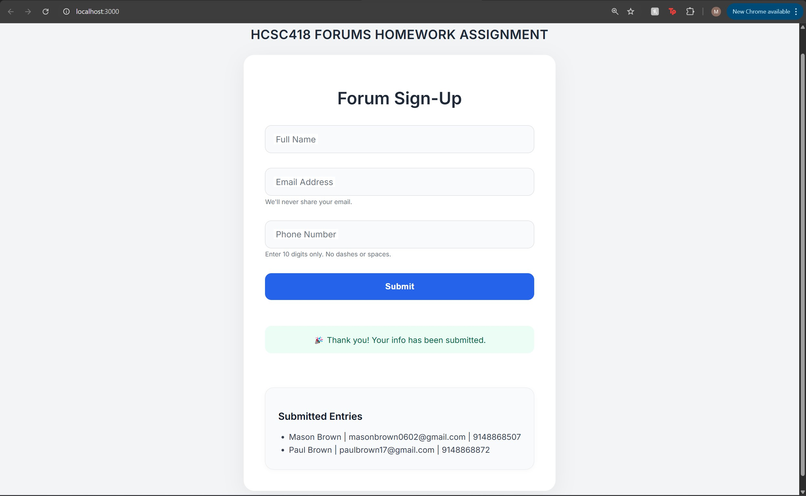

# HCSC418 Forums Homework Assignment

This project is a professional-grade React application built to demonstrate mastery of form handling, validation, styling, and optional backend integration using Docker. It was developed as part of the HCSC418 course and follows a structured assignment prompt focused on interactive forms.

---

## 🎯 Assignment Objectives

This assignment was created to help us practice:

- Working with React functional components
- Creating and handling form input
- Implementing real-time field-level validation
- Styling forms professionally using CSS
- Optionally integrating Docker + MongoDB backend
- Writing unit tests with Jest

---

## ✅ Features

✔️ Clean, modern UI using floating labels and card-style layout  
✔️ Form includes fields for **Name**, **Email**, and **Phone Number**  
✔️ Real-time **field-level validation** to prevent errors  
✔️ Error messages are styled clearly under each field  
✔️ Submissions are displayed in a list below the form  
✔️ Smooth responsive design  
✔️ Extra credit options implemented (see below)

---

## 🚀 What the Application Does

- Accepts user input for Name, Email, and Phone Number
- Validates input as the user types (e.g. email format, 10-digit phone number)
- Prevents invalid form submission
- Shows all submitted entries live on the page
- Displays a confirmation message upon successful submission

---

## 📂 File Overview

- `App.js` – Top-level layout component with title and wrapper card
- `BasicForm.js` – Main form logic with validation and submission handling
- `App.css` – Custom CSS implementing a polished floating label UI
- `index.js` – App entry point rendering the React application
- `BasicForm.test.js` – Unit tests for validation and form behavior
- `Dockerfile` & `docker-compose.yml` – Optional backend support with MongoDB

---

## 🛠️ Running the App

### Local (Frontend Only)

```bash
npm install
npm start
```

Open your browser to http://localhost:3000

### 🐳 Dockerized Backend

```bash
docker compose up --build
```

- React frontend: http://localhost:3000
- Backend API: http://localhost:5000
- MongoDB: mongodb://mongo:27017/forumsdb

### How to Stop Docker Services

To shut everything down, press Ctrl + C in the terminal, then run:

```bash
docker compose down
```

- This will stop and remove the containers, but keep your data in the mounted volume (`mongo-data`)

---

## 🧪 Running Unit Tests

```bash
npm test
```

---

## 🛠️ Technical Requirements

### Prerequisites

- Node.js (v14.0 or higher)
- npm (v6.0 or higher)
- Docker Desktop
- Modern web browser (Chrome, Firefox, Safari, Edge)

### Supported Operating Systems

- Windows 10/11
- macOS 10.15 or later
- Linux (Ubuntu 18.04 or later)

---

## ✨ Extra Credit Achievements

✅ **Unit Tests** using Jest and React Testing Library (10 pts)  
✅ **Docker + MongoDB Integration** for persistent backend storage (20 pts)

---

## Application Screenshot



---

---

## Author

- Mason Brown
- Morehouse College - Computer Science
